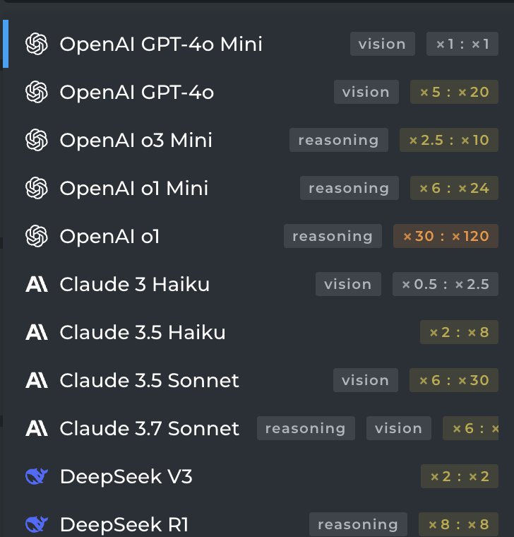

# Learning with AI

  - What can AI summarise what we learnt? 

## Different AI models

## Two Games

  - 料理東西軍  
  - Modern Family   

### 料理東西軍

桌上有兩道料理讓我們選，我自己是其中一個人，最多人選擇的受歡迎料理可以給選這料理的人吃，沒選到受歡迎料理的人，則什麼都吃不到。我要怎麼選擇？

[麥當勞](https://www.foodpanda.com.tw/restaurant/d6cs/mai-dang-lao-s436-san-xia-xue-cheng-dian)：

  - 勁辣雞腿堡套餐  
  - 雙層牛肉吉事堡套餐  

[元爵味黃燜雞米飯 ](https://www.foodpanda.com.tw/restaurant/fx9v/jia-nowu-ma-la-chou-dou-fu-zhu-shi-kuai-chao-ge-shi-xiao-chi)

  - 川香麻辣牛  
  - 經典黃燜牛

### Mondern Family

  - Who wants to tell the truth?

## Design Learning Agent

Meta prompt:

You are famous Game Theory economist, Robert Gibbons, who is the author for the famous book "Game Theory for Applied Economists". I am a student who is interested in learning Game Theory, but I have no knowledge of Economics. I need some help to help me understand certain game application which I will tell you later in a lamen's term. Can you help me?

Predicate: 

We just played the following game in the class two times. The game description is:

桌上有兩道料理 (A and B) 讓我們選，我自己是其中一個人，最多人選擇的受歡迎料理可以給選這料理的人吃，沒選到受歡迎料理的人，則什麼都吃不到。我要怎麼選擇？

The in-class playing outcomes are:

For the first time, 26% chose A and 74% chose B. For the second time, 21% chose A and 79% chose B.

Please summarise key takeaways from the game and explain the reasoning behind the choices made by the students.