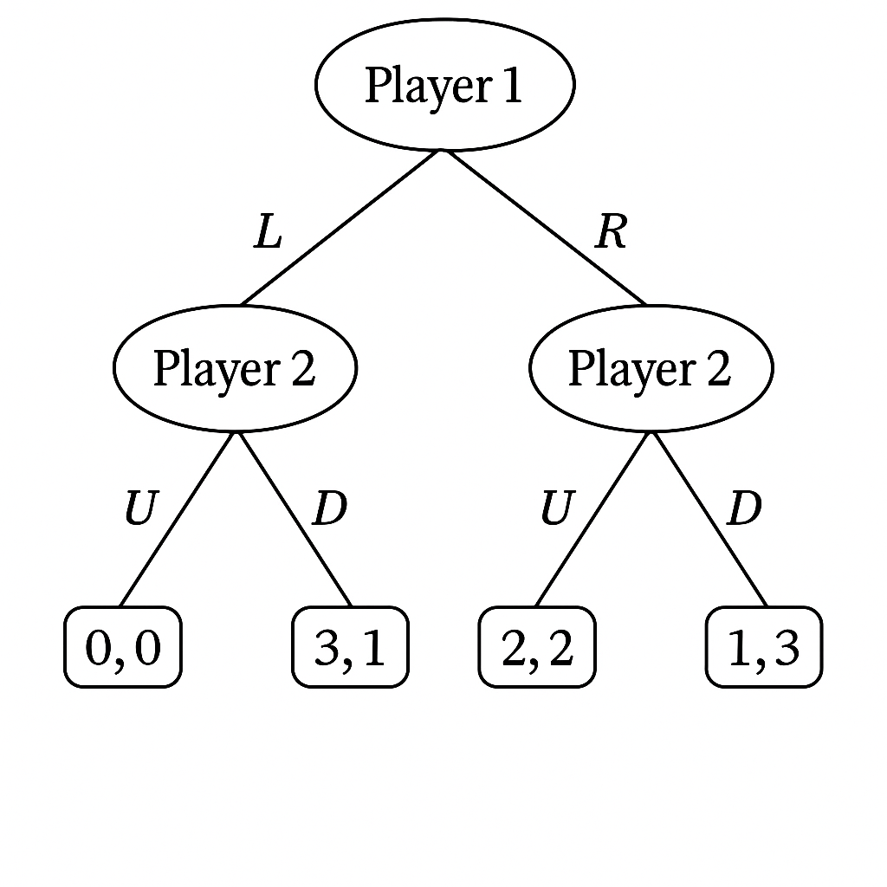

## Understand Dynamic Games with AI

--- 

### Mermaid Game Tree

#### Mermaid Syntax in markdown

Mermaid syntax是一種用來描述流程圖、序列圖、甘特圖等的語法。它是一種基於JavaScript的繪圖工具，在Markdown文件中使用Mermaid syntax描述圖形，在如下的code chunk中，Mermaid syntax的描述會被轉換成圖形。

\`\`\`mermaid  

mermaid syntax  

\`\`\`

  - 可以在[hackmd](https://hackmd.io/)中使用。

> slido: 請AI產生mermaid syntax的範例，並放在HackMD中顯示（貼上HackMD的連結）

#### AI Generated Game Tree

  - Prepare a game tree (hand drawn or digital)  
  - Upload to ChatGPT and ask it to draw in **mermaid syntax**.

#### Fine tune AI 

  - Tell AI what to adjust (fine tune) in the tree design. 
  - Once the mermaid tree is what you want, this chat can be used as a fine-tunined session for future game trees drawing.
  
---

手繪game tree變成mermaid syntax. 

---

### Dynamic Game Example

#### Game description

玩家 1 先選 L 或 R；玩家 2 觀察後選 U 或 D。四種結果：

* (L,U) → (0,0)
* (L,D) → (3,1)
* (R,U) → (2,2)
* (R,D) → (1,3)

> slido: 你覺得這個遊戲中，誰比較有優勢？為什麼？

---

#### Game tree

> slido: 使用fine-tuned chatgpt，讓它幫我們畫出這個遊戲的決策樹, 貼上hackmd連結。

---

#### Strategy space

  - 策略（strategy）是指在**遊戲中**，玩家所能選擇的行動（moves）。  

> slido: 玩家1的可選擇的策略是什麼？
> slido: 玩家2的可選擇的策略是什麼？

#### Best response

> slido: 玩家1選擇L時，玩家2的最佳'策略'是什麼？

---

#### Backword induction 找出 SPNE

> slido: 這裡的Subgame Perfect Nash Equilibrium是什麼？

---
