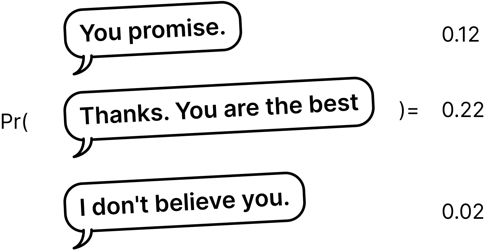

# Use AI $\times$ to learn

Goals:

 - "Use AI"."to learn"

> Does AI has human-like knowledge for us th learn from?
> If yes, how to ask AI to teach us?

## How AI chats with you


```
Person A:  Hey! Did you catch the meteor last night?

Person B:  No, I totally slept through it! Was it good?

Person A:  Amazing! So many shooting stars. I even think I saw a really bright one.

Person B:  Ugh, I'm so bummed I missed it. I set an alarm, but I guess I turned it off in my sleep.

Person A:  Well, there's always next year! We'll make sure you stay awake then.
```

### A predicator of conversation




$$
\Pr(\text{Person B's response} | \text{Chat history})
$$


### LLM Mechanism for dummies
  
LLM stands for Large Language Model. It is a model that can predict the next word in a sentence.

  - Token: the smallest identifies of human language  (<https://tiktokenizer.vercel.app/>)
  - Embedding of a token: a collection of numbers (aka vector) that represent the meaning (?) of a token  
  - Tensor: a collection of embeddings of tokens that represent the meaning of a sentence  

### To learn from AI

Can we learn from AI?
Can prediction of the next word in a sentence help us learn?

  - Yes, only if **the prediction direction** makes sense to us.  

### Slido

[slido](slido.md)

> slido: 你認為對話歷史中的哪些元素會影響不同回話的機率？

> slido: 自我介紹

### Conversation with AI

[ChatGPT & Grok](share-AI-chat-link.md)

> slido: 與 AI 對話